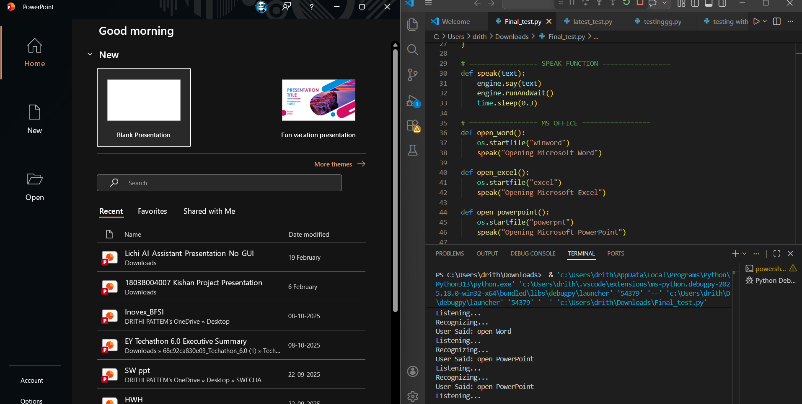
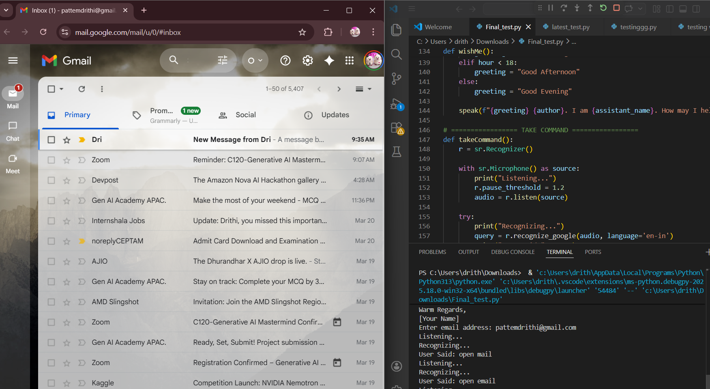
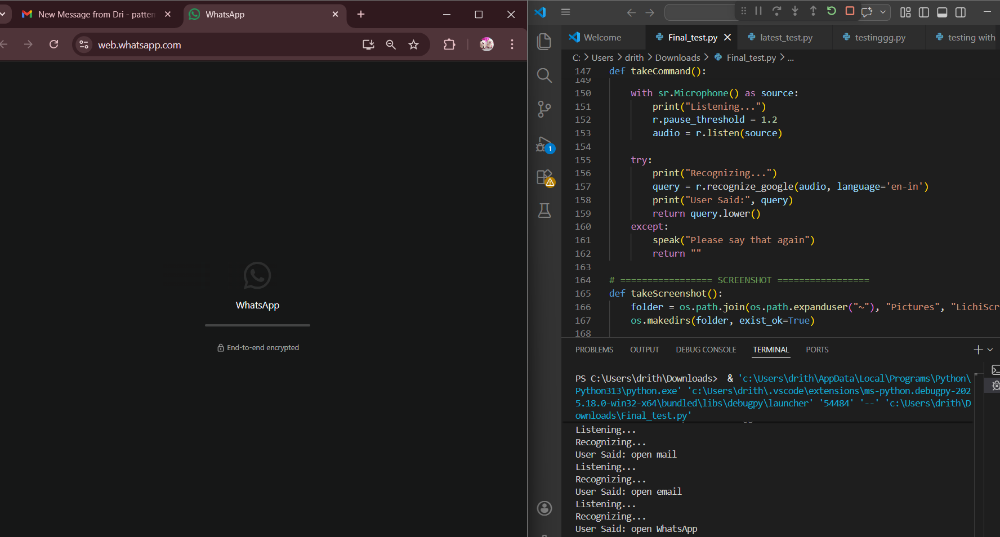
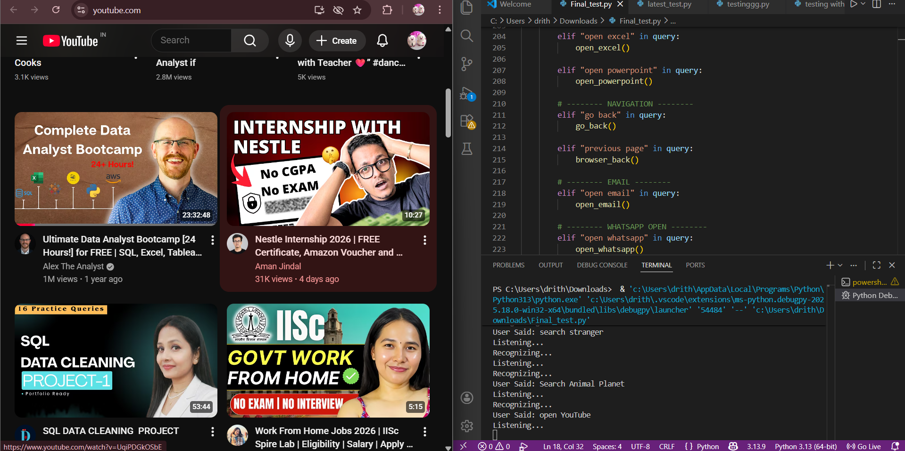
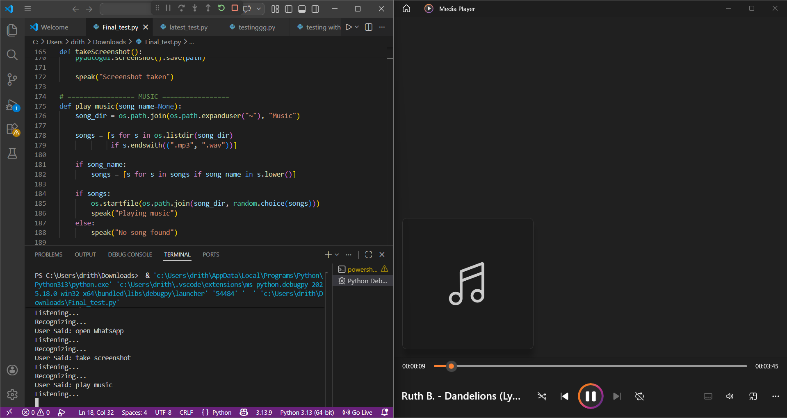

# AI-Based-Voice-Controlled-Intelligent-Assistant-for-Hands-Free-Automation

## 📌 Overview
This project is a voice-controlled AI assistant that enables hands-free interaction with a computer system.

## 🚀 Features
- Voice command execution
- Email automation using AI
- MCP + phi3 model (Ollama integration)
- Web automation (YouTube, Google)
- Application control (Excel, PowerPoint)

## 🧠 Technologies Used
- Python
- SpeechRecognition
- pyttsx3
- PyAutoGUI
- Ollama (phi3:mini)

## 📊 Results
- Accuracy: 88–92%
- Response Time: 1–3 seconds

## 🔮 Future Enhancements
- Multilingual support
- Advanced AI models
- Mobile integration
## 📸 Screenshots

### Excel Opening

### PowerPoint Opening

### Gmail Access

### WhatsApp Web

### YouTube Automation

### Music Playback

## 👩‍💻 Author
Drithi
